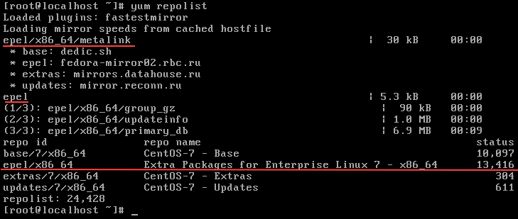
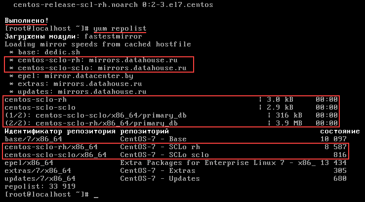
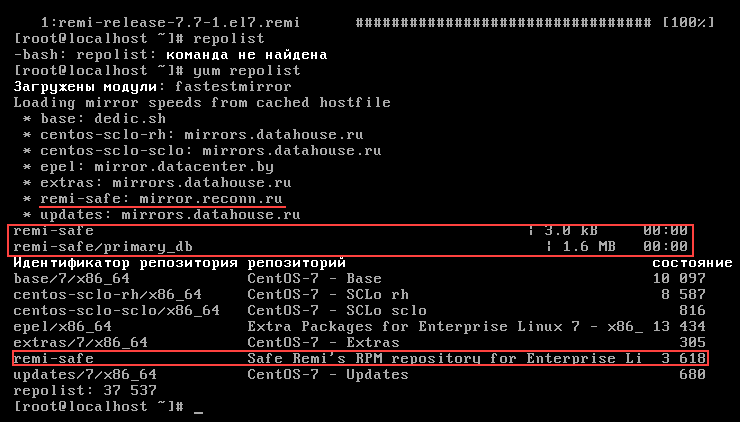
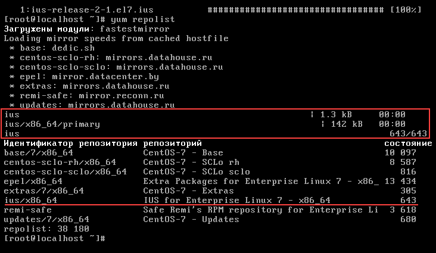

# Install most popular repositaries  

1. EPEL  
2. SCL  
3. Remi Collet
4. IUS  
5. nux-desktop  
6. delete and disable repositaries  

### NOTICE:  
###### before you wanna configure repolist, please follow [MINIMAL INSTALL CENTOS-7](https://github.com/maxlavr/centos-7/minimal/ "FOLLOW TO INSTALL")  

***  

1. ### EPEL  

	> yum install epel-release

	  

2. ### SCL  

	> yum install centos-release-scl  

	  

3. ### REMI COLLET  

		# Remi Collet contains big collection of update packeges for CentOS from project Remi RPM.  
		# The repo is EPEL dependent.  
		# Notice the packages from this repo have the same names as an official, therefore,  
		# it may cause an unwanted update, so be careful  

		# for install we need download rpm package, do:  

	> wget http://rpms.famillecollet.com/enterprise/remi-release-7.rpm  
	> sudo rpm -Uvh remi-release-7*.rpm  

	  

4. IUS  

		# this is official repo with newest(latest) versions of packages of RedHat  
		# here, the package names differ from the ones used in the default repository from CentOS,  
		# so there will be no problems with the update  
		# to install the CentOS 7 repository, run  

	> wget http://centos7.iuscommunity.org/ius-release.rpm  
	> sudo rpm -Uvh ius-release*.rpm  

	  
