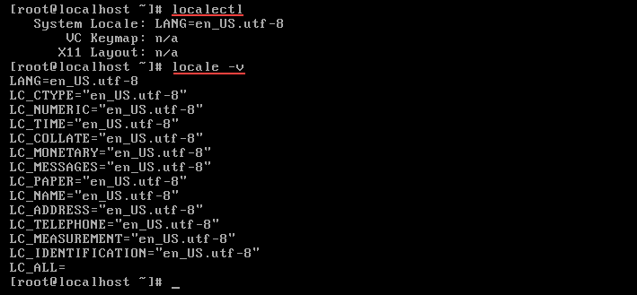
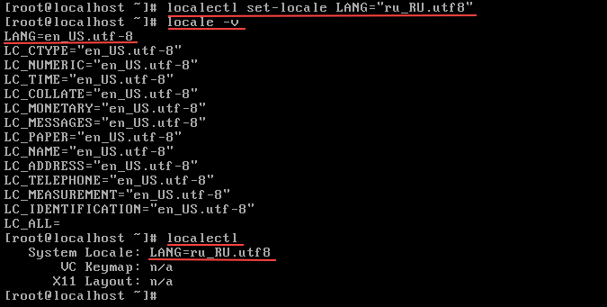
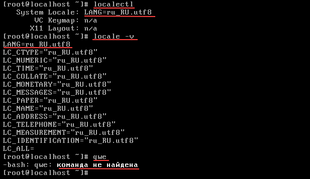
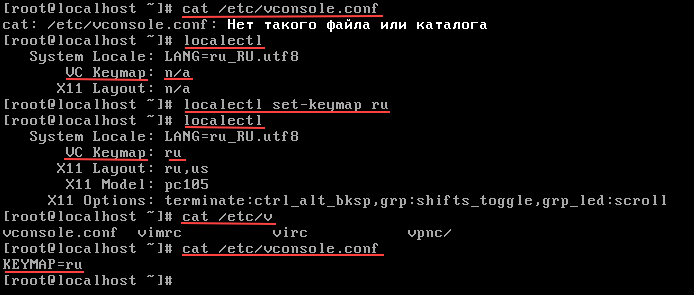
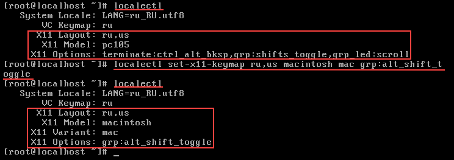

# This is guide aboute configuration keyborad in centos-7
1. Lets talk about 'localectl' and 'locale'  
2. Change Language and Encoding (FIRST METHOD)  
3. Change Language and Encoding (SECOND METHOD)  

### Notice
	I recommended first of all to configure the basic/minimal tools in your system,  
	but you can to do it later. This is your choice, this is your life)  

#### HELPER LINK: [TO INSTALL MINIMAL CENTOS](../minimal/ "FOLLOW THIS LINK TO MINIMAL")  

***

1. ### Lets talk about 'localectl' and 'locale'  

	#### 1.1 localectl & locale  

		# localectl is util that control system locale and keyboard layout settings  
		# locale is perl programm to use or avoid POSIX locales for built-in operations  

	> man localectl  
	> man locale  

		# the configuration file named locale.conf  

	> man locale.conf  

		# it's located in /etc/locale.conf  
		# to know more about your configuration now type:  

	> locale  
	> locale -v  
	> localectl  

		#output will print some params, you can know about them by follow link  

	#### 1.2 locale

	#### THIS LINK CAN HELP YOU [MAN-LOCALE-OFFICIAL](https://jlk.fjfi.cvut.cz/arch/manpages/man/locale.1.en "man locale official")  

		#you need the mean some of 'locale' params (about anothers you can know follow the link):  
		- LANG (LANGUAGE)  
		- LS_MESSAGES (This category affects the language in which messages are displayed and what an affirmative or negative answer looks like)  
		- LC_ALL (All for above)  

		# locale have flags -a | -m  
		# locale -a (--all-locales) display a list of all of available locales (cat /usr/lib/locale/locale-archive)  
		# locale -m (--charmaps) display all of avalable charmaps 

		# for more info:  

	> locale -a -v  

		# infomations of this output located in /usr/lib/locale/locale-archive  

	#### 1.3 localectl  (+ XKB configuration)

	#### THIS LINK CAN HELP YOU [XKB-CONFIGURATION-GUIDE](https://www.x.org/releases/current/doc/xorg-docs/input/XKB-Config.html#Basic_Configuration  "XKB Configuration Guide")  

		# localectl may be used to query and change the:  
		# - system locale (the lenguage settings of system services, UI)  
		# - keyboard layout settings (the keyboard layout used on the text console and graphical UI)  

		# the full list of keyboard models /usr/share/X11/xkb/rules/base.lst

	> cat /usr/share/X11/xkb/rules/base.lst

		# config file /etc/X11/xorg.conf.d/00-keyboard.conf  
		
	> cat /etc/X11/xorg.conf.d/00-keyboard.conf  

		# The parameters are:

		# XkbRules - files of rules to be used for keyboard mapping composition  

	> ls -l /usr/share/X11/xkb/rules  

		# XkbModel - name of the model of your keyboard type  

	> localectl list-x11-keymap-models  
	> cat /etc/X11/xorg.conf.d/00-keyboard.conf  | less  
	> > push: / and  print: "! model"  

		# XkbLayout - layout(s) you intend to use  

	> localectl list-x11-keymap-layouts  
	> cat /etc/X11/xorg.conf.d/00-keyboard.conf  | less    
	> > push: / and  print: "! layouts"    
	
		# XkbVariant - variant(s) of the layout you intend to use  

	> localect list-x11-keymap-variants   
	> cat /etc/X11/xorg.conf.d/00-keyboard.conf  | less   
	> > push: / and  print: "! variants"    

		# XkbOptions - extra xkb configuration options  

	> localect list-x11-keymap-options  
	> cat /etc/X11/xorg.conf.d/00-keyboard.conf  | less  
	> > push: / and  print: "! options"  

		##	ANOTHER FILES  

		 #	/usr/share/X11/xkb/compat  

		 #	/usr/share/X11/xkb/compiled  

		 #	/usr/share/X11/xkb/geometry  

		 #	/usr/share/X11/xkb/keycodes  

		 #	/usr/share/X11/xkb/keymap  

		 #	/usr/share/X11/xkb/rules  

		 #	/usr/share/X11/xkb/semantics  

		 #	/usr/share/X11/xkb/symbols  

		 #	/usr/share/X11/xkb/types  

***

2. ### Change Language and Encoding (FIRST METHOD)  
	#### 2.1 TEMPORARILY    
		# for a few time (after reboot all settings that you set will change for default)  
		# you should set value for global param LANG  
		# before print current value

	> echo $LANG

		# to change for rus for example type:  

	> LANG=ru_RU.utf-8  

		# after type to check:  

	> echo $LANG  

	#### 2.2 PERMANENTLY  
		# if you don’t want to manually change the language and encoding each time  
		# you connect, you can set the locale on an ongoing basis  
		# edit ~/.bashrc or ~/.profile and add LANG='value' in  

	> vi ~/.bashrc

		# or

	> vi ~/.profile  

		# add line  

	> LANG=ru_RU.utf-8  

		# The change will take effect the next time you log in,  
		# but you can speed it up by running one of the commands below  

	> source ~/.bashrc  

		# or  

	> source ~/.profile  

	#### 2.3 DEFAULT  
		# Follow these steps to change the default system locale (for all users)  
		
	##### 2.3.1 edit config file

	> vi /etc/locale.conf  

	##### 2.3.2 add some params to file    

	> LANG="ru_RU.utf-8"  
	> LC_MESSAGES="ru_RU.utf-8"

	##### 2.3.1 reload script locale.sh

		# After making changes to the locale.conf files, they will take effect  
		# after a system reboot, or you can use force method and do:  

	> source /etc/profile.d/sh.locale  

***

3. ### Change Language and Encoding (SECOND METHOD)  

	##### 3.1 use localectl  

		# for default template is:  

	> localectl set-locale LOCALE  

		#(for System Locale: ..)  

		# the result will be in:  
		# /etc/locale.conf  

	> localectl set-keymap KEYMAP 
		
		#(for Virtual Console: ..)  

		# the result will be in:   
		# /etc/vconsole.conf (settings for Virtual Console)  

	> localectl set-x11-keymap LAYOUT [ MODELS [ VARIANTS [OPTIONS] ] ]  

		# the result will be in:  
		# /etc/X11/xorg.conf.d/00-keyboard.conf  (settings for graphical mode ~ X11)  

	### EXAMPLE:  
		# now we have this station:  

	  

		#set up the 'System Locale', type:

	> localectl set-locale LANG="ru_RU.utf8"  

	  

		# we have some diffrents -> REBOOT  
		# let's check once more  

	  

		# after we need to configure 'VC(Virtual Console) Keymap, type:  
		# ps. my will be 'ru', your can be the same or diff

	> localectl set-keymap ru  

	  

		# and if you wanna set up locale for GUI mode type next:  
		# example: localectl set-x11-keymap LAYOUT [ MODELS [ VARIANTS [OPTIONS] ] ]  

	> localectl set-x11-keymap ru,us macintosh mac grp:alt_shift_toggle  

	  

		# ru,us - languages that you will use in GUI and change by combinatoin of keys: alt+shift  
		# macintosh - model of your keyborad(most popular pc104, pc105) and mac variant of position keys on keyborad(most popular dvorak and others)  
		# we need another reboot for the changes to take effect from our config, let's start  

	##### 3.2 use setxkbmap  
		# this util is very similar localectl  

		# this is template to set up:  
	
	> setxkbmap [-model xkb_model] [-layout xkb_layout] [-variant xkb_variant] [-option xkb_options]  

		# to change the layout, enter (-layout - the standard flag):  

	> setxkbmap xkb_layout

		# for multiple settings  

	> setxkbmap -model macintosh -layout us,ru -variant mac, -option grp:alt_shift_toggle

		# or

	> setxkbmap -model pc105 -layout us,ru -variant dvorak, -option grp:alt_shift_toggle

		# and etc ...  

	##### THIS LINK CAN HELP YOU TO KNOW WHAT IS [SETXKBMAP](https://wiki.archlinux.org/index.php/Xorg_(Русский)/Keyboard_configuration_(Русский))  

