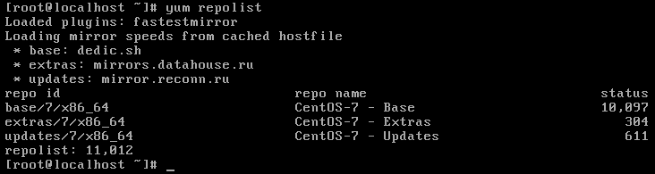

# FIRST SETTINGS AFTER INSTALL CENTOS7
### 1. Before install you need to be sure that your network connection is establish.  
	To check this you can try ping some services as yandex, google or if network not  
	establish you should configure it.  

#### CONFIGURE NETWORK HELPER: [HELPER LINK](../network/ "FOLLOW THIS LINK")  

### 2. You should to configure yum package manager. If it's not available, please, configure.  
	to check type in terminal:  
  
> yum repolist  

	good result:

###   
---  
