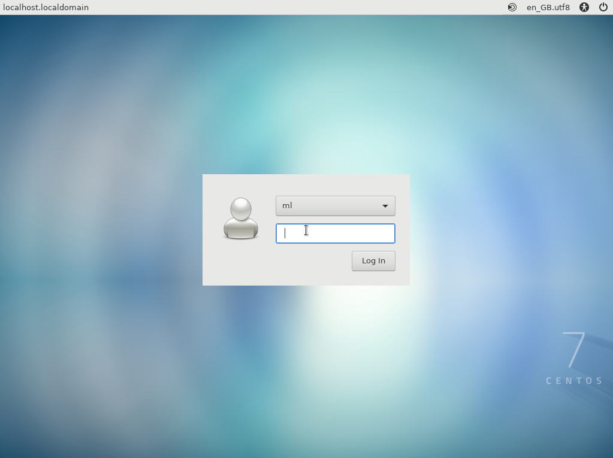
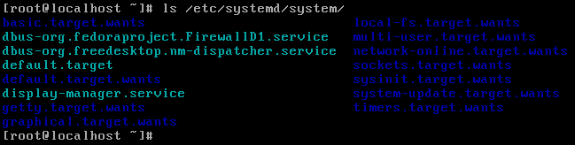
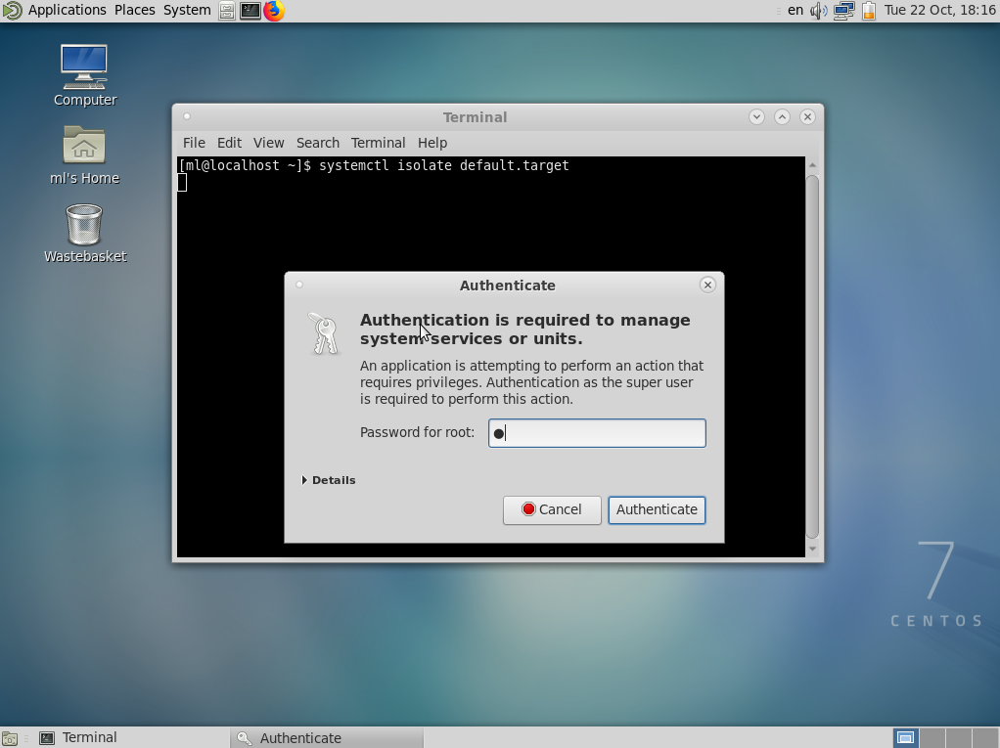

# FIRST SETTINGS AFTER INSTALL CENTOS7
1. ### Before install you need to be sure that your network connection is establish.  
	To check this you can try ping some services as yandex, google or if network not  
	establish you should configure it.  

	#### CONFIGURE NETWORK HELPER: [HELPER LINK](../network/ "FOLLOW THIS LINK")  

2. ### You should to configure yum package manager. If it's not available, please, configure.  
		to check type in terminal:  
  
	> yum repolist  

		good result:  

	

		but here no "epel", no "remi" and another repositories

3. ###  If your configuration is ok (network, yum), let's start:  
	#### 3.1
		this command list all availible groups to install:  
	> yum grouplist  

		it will include: mandatory, default and optional groups

	> yum groupinfo "Minimal Install"  

		this command list all packages that include your group in "..."  
		  
		for the next step we need "epel" repository, lets install it by type:  

	> yum install epel-release  

		check:  

	> yum repolist  

	

		now we see that repo EPEL is loaded and connect

	### 3.2  
		Lets isntall GUI. We need for this some grouplist: "Development Tools", "X Window System"

	> yum groupinstall "Development Tools"  
	> yum groupinstall "X Window System"  
	> yum groupinstall "Mate Desktop"

		if you wanna load graphical interface (GUI) type:
	> systemctl isolate graphical.target  

		# isolate is the simmilar change runlevel in a tradition init system
		# it's immediatly stop run processes that are not enabled in a new unit

	

		you can see other targets here:
	> ls /etc/systemd/system/

	

		to load with default mode:
	> systemctl isolate default.target

	  

###   
---  
