# NETWORK (you can use this ways to edit network settings)
1. ## NMTUI (NetworkManager TUI)
2. ## EDIT CONFIG FILES:
	### /etc/sysconfig/network-scripts/ifcfg-enp0s3  
		# enp0s3 my interface, your can diff
		# here you should know some params:
			TYPE 		- Ethernet/Wired
			BOOTPROTO	- how to get IP: static/dhcp/none
			NAME		- "name of connection"
			DEVICE		- "name of interface"
			ONBOOT		- "tell machine to start this interface when your system start": yes/no
			IPADDR		- IP address that this machine will be use
			GATEWAY		- network access GATEWAY
			NETMASK		- network NETMASK
			DNS		- server for resolving DNS domain names
***

## Description
1. ### NMTUI (NetworkManger TUI)
	  
	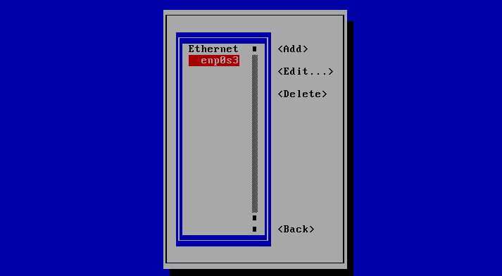
	  
	#  
		here you should to choose static/dynamic, my way will be static
	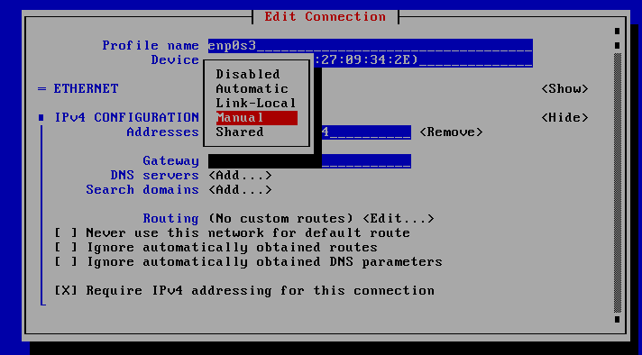  
	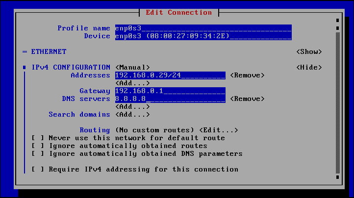  
	  
	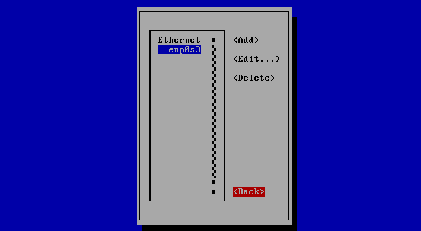  
	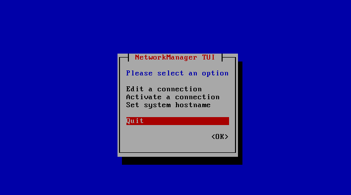  
	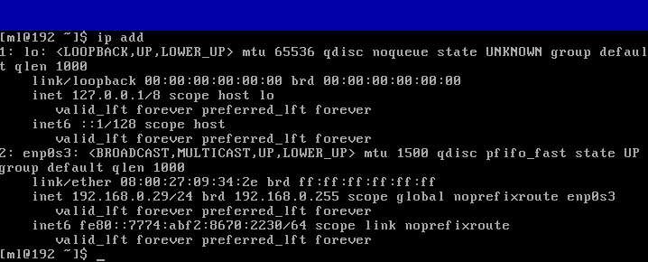  

2. ### EDIT CONFIG FILES  
	#
		2.1 check your network status  

	> ip add  
	> nmcli d  

	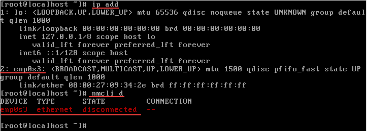  
  
	> network is disconnected

	#  
		2.2 stop all network services  

	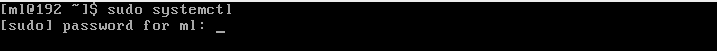  
	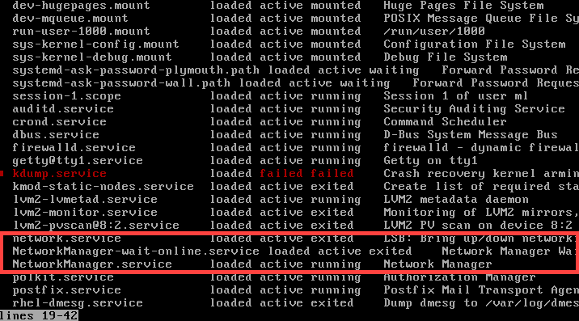  
	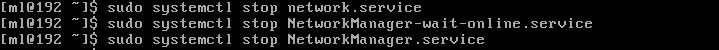  
	#  
		2.3 sudo vi "config file"  

	  
	#  
		2.4 edit config file(my config is manual)  

	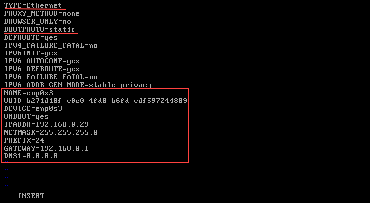  
	#  
		# add / or edit some params(you should adapt your machine):  
		TYPE=Ethernet  
		DEVICE=enp0s3    
		ONBOOT=yes  
		IPADDR=192.168.0.29  
		PREFIX=24  
		NETMASK=255.255.255.0
		GATEWAY=192.168.0.1  
		DNS1=8.8.8.8

	sudo systemctl start network services  
	  
			"ping" or "nmctl d"
	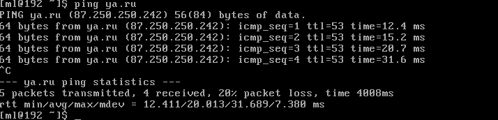
