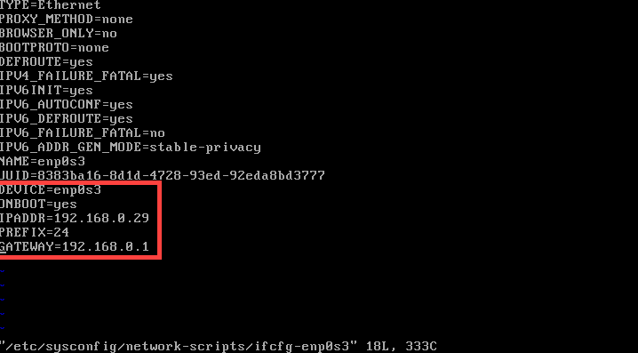

# NETWORK

## YOU CAN USE 2 WAYS EDIT NETWORK SETTING
1. ## NMTUI (NetworkManager TUI)
2. ## EDIT CONFIG FILES:
	### /etc/sysconfig/network-scripts/ifcfg-enp0s3  
		# enp0s3 my interface, your can diff
		# here you should know some params:
			TYPE 		- Ethernet/Wired
			BOOTPROTO	- how to get IP: static/dhcp/none
			NAME		- "name of connection"
			DEVICE		- "name of interface"
			ONBOOT		- "tell machine to start this interface when your system start": yes/no
			IPADDR		- IP address that this machine will be use
			GATEWAY		- network access GATEWAY
			NETMASK		- network NETMASK
			DNS		- server for resolving DNS domain names
***

## Description
1. ### NMTUI (NetworkManger TUI)
	  
	
	  
	* IPv4 CONFIGURATION: choose your
		- if "automatic" scroll down and press <OK...> 
		  
		- else edit settings scroll down and press <OK...>  
		  
		  
	* press <Back ...>  
	  
	* press <Quit ...>  
	  
	* result  
	  

#
2. ### edit config file
	* type: stop all network services
		-   
		-   
		-   
	* sudo vi "config file"
		-   
	* edit config file(my config is manual)  
		  
		- add / or edit some params(you should adapt your machine):  
			TYPE=Ethernet  
			DEVICE=enp0s3    
			ONBOOT=yes  
			IPADDR=192.168.0.29  
			PREFIX=24  
			NETMASK=255.255.255.0
			GATEWAY=192.168.0.1  
			DNS1=8.8.8.8
	* sudo systemctl restart network services  
		  
		- "ping" or "nmctl d"
		
