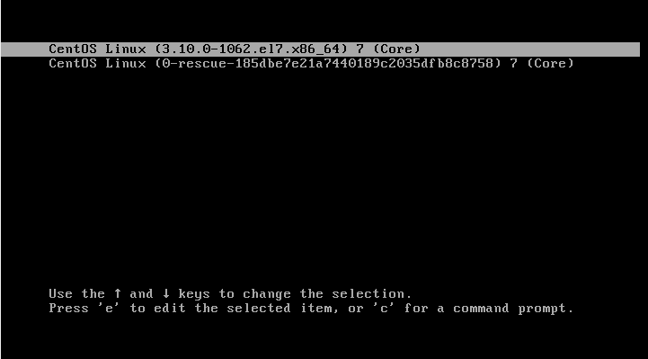
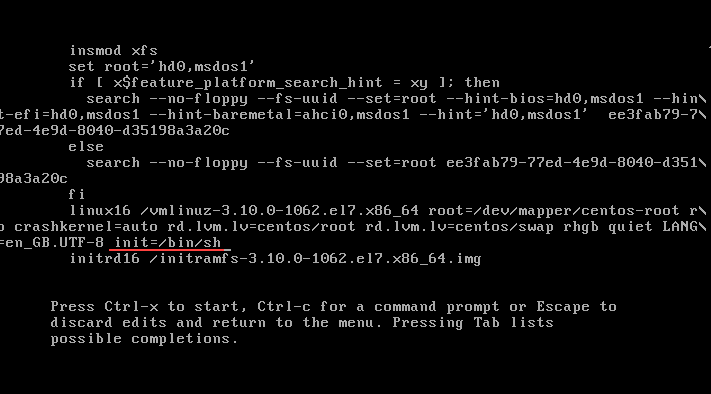
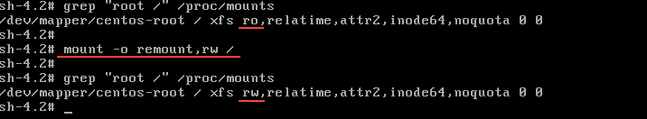
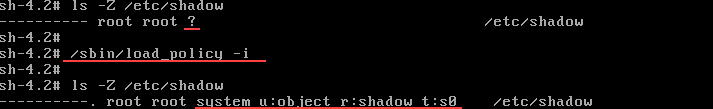
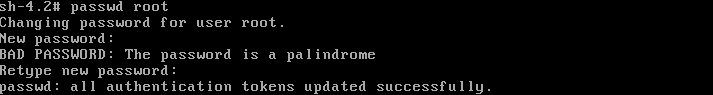

# RESET PASSWORD  
how to reset password(root and etc.) in system using SELinux like Centos-7  

## Description  
1. ### First of all you need to start you OS and stop here:
	* type "E" to edit kernel  
	  
2. ### Find string that begin with linux, move your pointer to end of str and print:  
	* init=/bin/sh  
	  
	- frst of all start init process, but now you tell: "init" please load shell "/bin/sh"   
	* please type: CTRL+X, this is need to load
3. ### Remout your "root /" to "ReadWrite":  
	* mount -o remount,rw /  
	  
	- you can check your remount like in this picture  
4. ### CentOS using SELinux policy, thats why you need to load context of security like this:  
	* /sbin/load_policy -i  <---or--->  load_policy -i  
	  
	- check instruction like in this picture  
5. ### Now you can choose password of root or another user like this:  
	* passwd root <---or---> passwd user  
	  
#  
- after all that you need to type:
	* reboot 
- or you can type:  
	* exec /sbin/init
