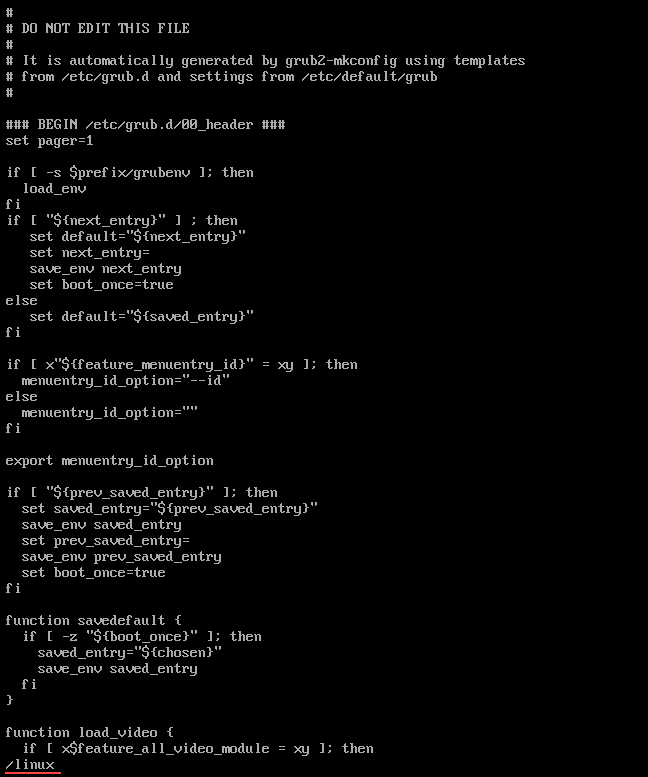
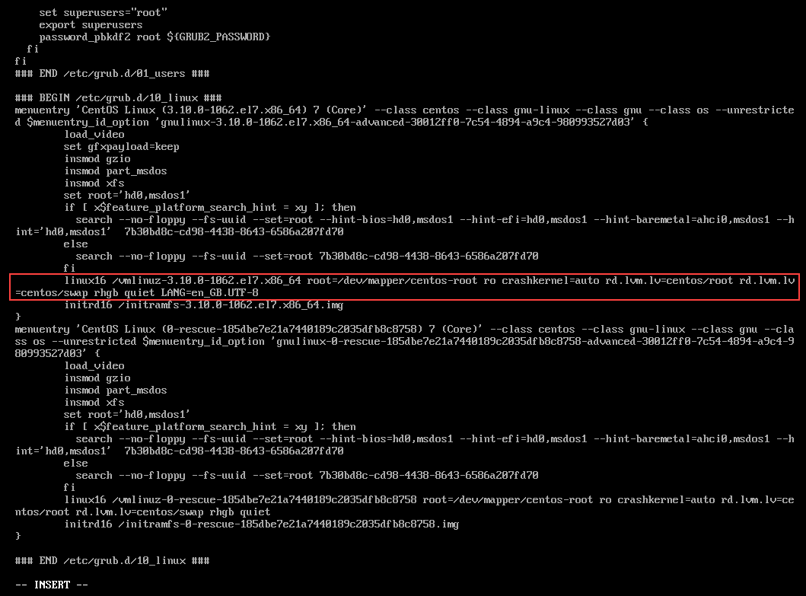
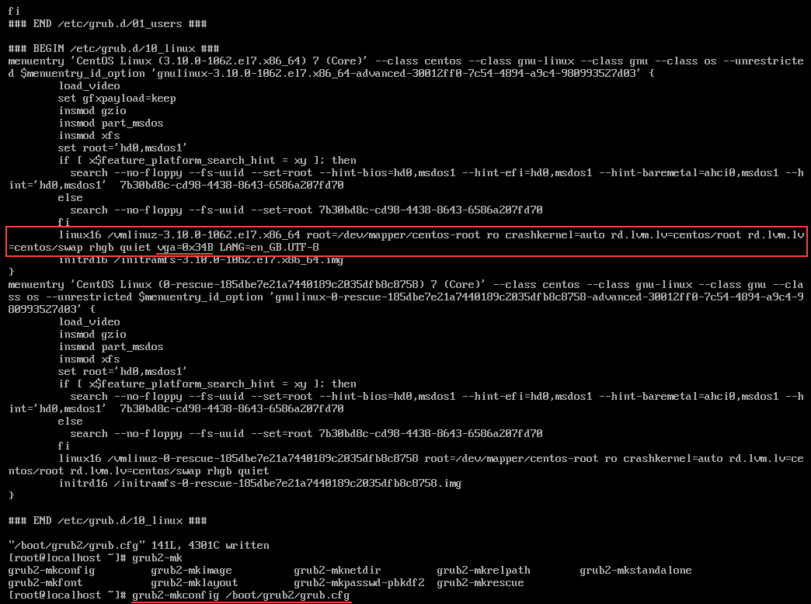

### Change video quality of console  

	this is a short manual how to change media quality of your conosole(ttys)  
	in this artical we will talk about method with edit grub2 configuration  

1. ### step 1 configure grub2  

	###### open your grub  
  
> vi /boot/grub2/grub.conf  

	# find string which begin with linux  
	# to find them type '/linux' in vim  

  

	# type enter to find and find string below  

	# after you find the string type: vga=0xCODE from table below  

	# CODE	QUALITY		BITS  
	# F00	80×25		—  
	# F01	80×50		—  
	# F02	80×43		—  
	# F03	80×28		—  
	# F05	80×30		—  
	# F06	80×34		—  
	# F07	80×60		—  
	# 346	320×200		8  
	# 30D	320×200		15    
	# 30E	320×200		16    
	# 30F	320×200		24     
	# 340	320×200		32    
	# 300	640×400		8    
	# 341	640×400		32    
	# 301	640×480		8    
	# 310	640×480		15    
	# 311	640×480		16    
	# 312	640×480		24    
	# 342	640×480		32    
	# 303	800×600		8    
	# 313	800×600		15    
	# 314	800×600		16  
	# 315	800×600		24  
	# 343	800×600		32    
	# 305	1024×768	8  
	# 316	1024×768	15  
	# 317	1024×768	16  
	# 318	1024×768	24  
	# 344	1024×768	32  
	# 348	1152×864	8  
	# 349	1152×864	15  
	# 34A	1152×864	16  
	# 34B	1152×864	24  
	# 34C	1152×864	32  
	# 307	1280×1024	8  
	# 319	1280×1024	15  
	# 31A	1280×1024	16  
	# 31B	1280×1024	24  
	# 345	1280×1024	32  
	# 347	1600×1200	32  

	# after type your QUALITY please save your changes  
	# and save configuration grub2  

> grub2-mkconfig /boot/grub2/grub.conf  

  
	